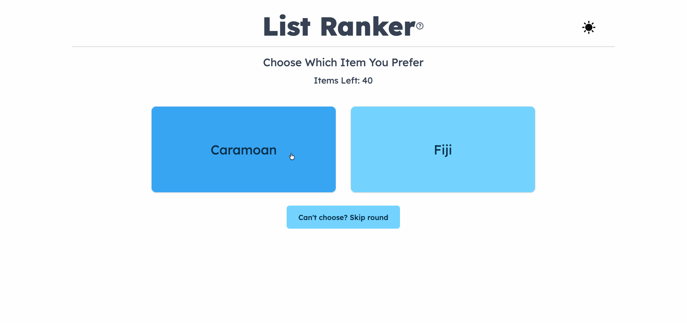

# List Ranker

Ordering a list of 20 items by preference is cognitively exhausting if you try to do it all at once. List Ranker breaks it down into a series of simple head-to-head matchups. Each round you pick your preferred item, with the ability to skip the round, until you have created a ranked list based on your choices.

Inspired by [this Pokémon ranker](https://fio4ri.github.io/FavoritePokemon/).

## Tech Stack

- **Backend:** Go with Gin — all ranking logic lives server-side
- **Frontend:** React, TypeScript, shadcn/ui
- **API:** Axios for client-server communication

## Features

- Premade lists to get started immediately
- Custom list creation
- Weighted ranking algorithm
- Dark mode

## Roadmap

- [ ] Better results display
- [ ] Save results to file
- [ ] Analytics
- [ ] More premade lists
